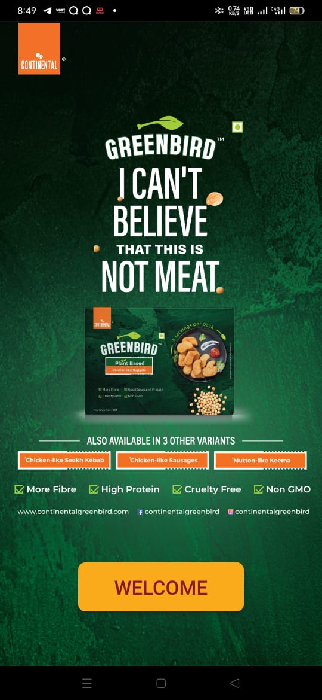
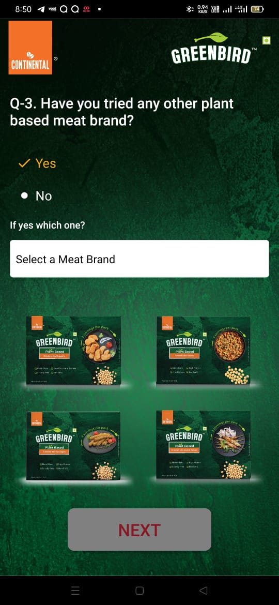
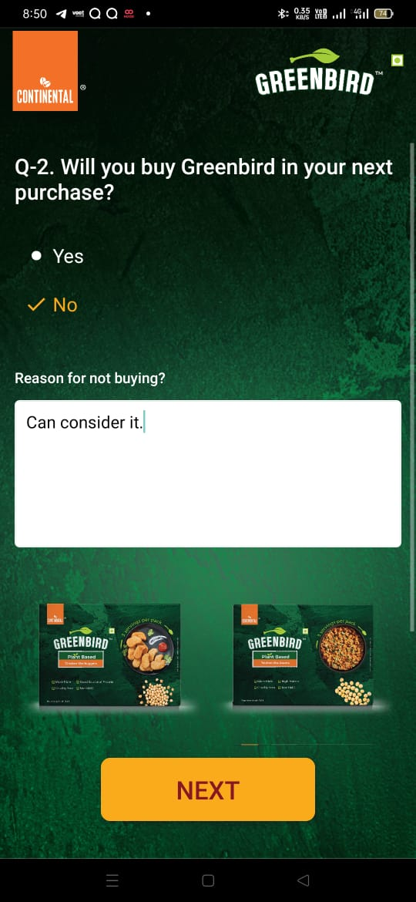
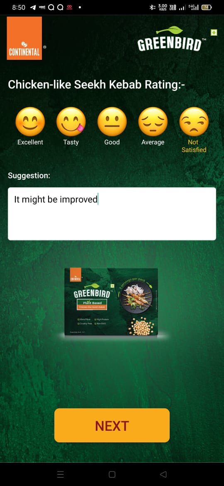
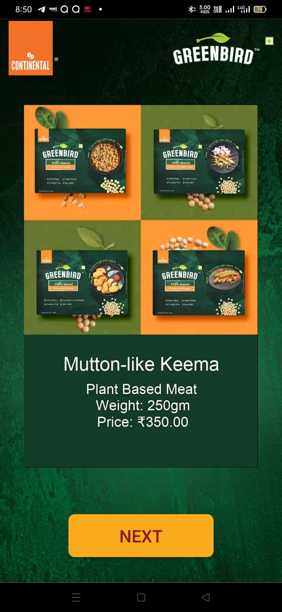
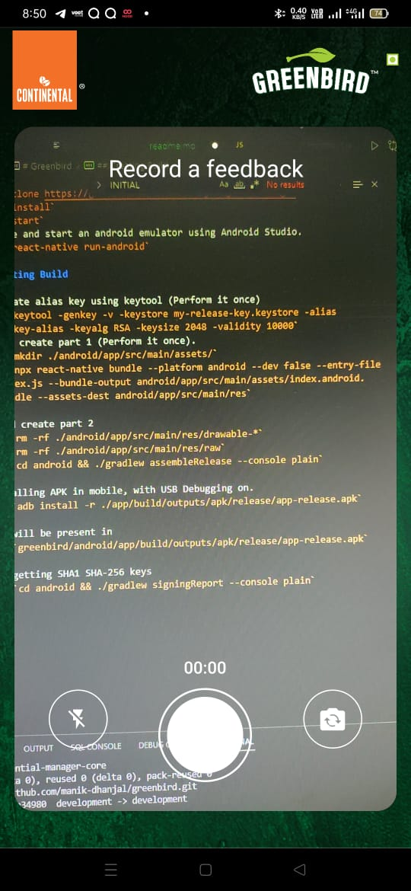
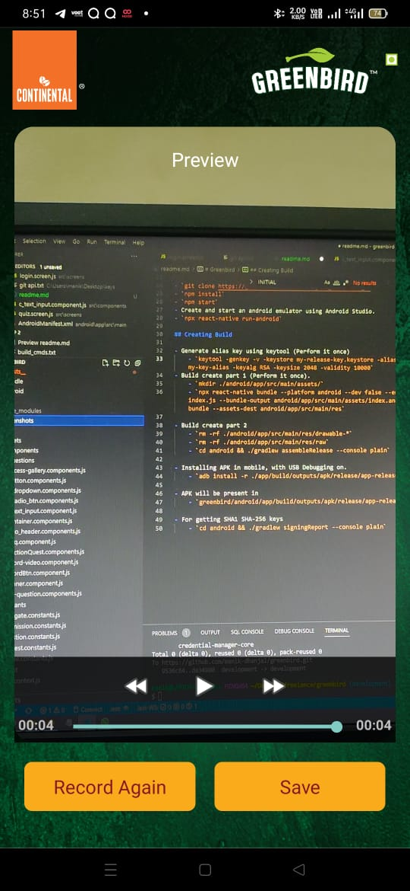
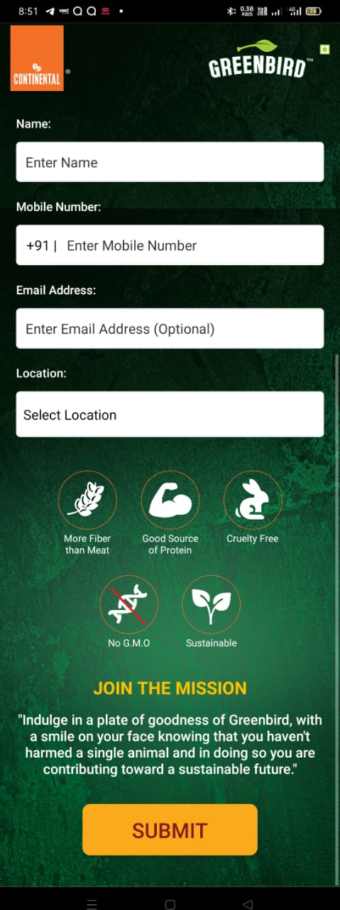

# Greenbird

Greenbird app is an android application made with react native for gathering the experince of customers tasting greenbird's product by asking questions and recording their review.

## Tech Used
 - React Native
    - React Native Vision Camera 
    - React Native firebase
    - React Native async Storage
    - React Navigation
    - React Native Compressor
    - React Native Vector Icons
    - React Native Simple Radio Buttons

- Firebase
    - Autherization
    - Storage
    - Firestore

## Development Environment Setup

- `git clone https://github.com/manik-dhanjal/greenbird.git`
- `npm install`
- `npm start`
- Create and start an android emulator using Android Studio.
- `npx react-native run-android`

## Creating Release Build APK

- Generate alias key using keytool (Perform it once)
    - `keytool -genkey -v -keystore my-release-key.keystore -alias my-key-alias -keyalg RSA -keysize 2048 -validity 10000`
- Build create part 1 (Perform it once).
    - `mkdir ./android/app/src/main/assets/`
    - `npx react-native bundle --platform android --dev false --entry-file index.js --bundle-output android/app/src/main/assets/index.android.bundle --assets-dest android/app/src/main/res`

- Build create part 2 
    - `rm -rf ./android/app/src/main/res/drawable-*`
    - `rm -rf ./android/app/src/main/res/raw`
    - `cd android && ./gradlew assembleRelease --console plain`

- Installing APK in mobile, with USB Debugging on.
    - `adb install -r ./app/build/outputs/apk/release/app-release.apk`

- APK will be present in 
    - `greenbird/android/app/build/outputs/apk/release/app-release.apk`

- For getting SHA1 SHA-256 keys
    - `cd android && ./gradlew signingReport --console plain`

## Screenshots

### Home Screen

### Feedback Screens

### Video record and preview Screens

### Persnoal info form screen
